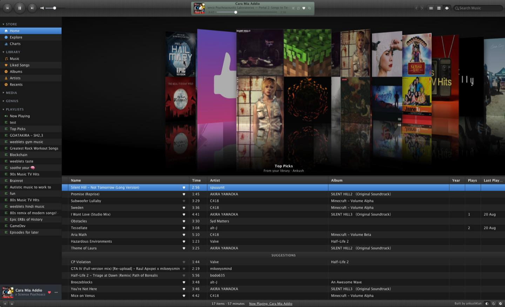

# Mixtunes

**Classic iTunes theme for Spotify, YouTube Music, SoundCloud and Apple Music.**

A free browser extension that themes the streaming sites you already use with a classic desktop music-library UI: sidebar sources, a sortable track list, Cover Flow, and transport controls. The host site stays the player. Your preferences stay on your device.

**YouTube Music works today.** Spotify, Apple Music, and SoundCloud are under development.

[Website](https://ankush.one/mixtunes/) · [Chrome Web Store](https://chromewebstore.google.com/detail/kaeebfmnanocpkfedmfgbkgjlihenjpm) · [Firefox Add-ons](https://addons.mozilla.org/firefox/addon/mixtunes/) · [Releases](https://github.com/ankushKun/mixtunes/releases) · [Privacy](https://ankush.one/mixtunes/privacy.html)

<p align="center">
  
</p>

## Features

- **Cover Flow** - album art you can flip through, with reflections
- **Sidebar library** - Music, Liked Songs, Albums, Artists, playlists
- **Track list** - sortable columns including Plays and Last Played
- **Themes** - Metal, Graphite, or match the system appearance
- **Local only** - no Mixtunes account; the extension does not phone home

Works on **Chrome 121+**, **Firefox 142+**, and Chromium-based browsers (Edge, Brave, Arc, Vivaldi, Opera, Zen). Not on Safari or mobile yet.

## Install

### From a store (recommended)

- **Chrome-family** — [Chrome Web Store](https://chromewebstore.google.com/detail/kaeebfmnanocpkfedmfgbkgjlihenjpm) (Chrome, Edge, Brave, Arc, Vivaldi, Opera)
- **Firefox / Zen** — [Firefox Add-ons](https://addons.mozilla.org/firefox/addon/mixtunes/)

### From a GitHub release

1. Open [Releases](https://github.com/ankushKun/mixtunes/releases) and download the zip for your browser:
   - `Mixtunes-…-chrome.zip` - Chrome, Edge, Brave, Arc, Vivaldi, Opera, Chromium
   - `Mixtunes-…-firefox.zip` - Firefox / Zen
2. **Chrome-family**  
   Unzip the file. Open `chrome://extensions` → enable **Developer mode** → **Load unpacked** → select the unzipped folder.
3. **Firefox**  
   Open `about:debugging` → **This Firefox** → **Load Temporary Add-on** → select the zip file (do not unzip). Temporary add-ons are cleared when Firefox quits. Prefer the [Firefox Add-ons listing](https://addons.mozilla.org/firefox/addon/mixtunes/) for a signed, persistent install.

Publishing a GitHub Release (tag like `v0.1.0`) runs CI that packs both zips and attaches them automatically. For a local version bump that keeps every file aligned:

```bash
npm run bump -- patch    # or minor / major / 0.2.0
npm run pack
```

That updates `package.json`, `package-lock.json`, `manifest.json`, and the site `softwareVersion` together. AMO and the Chrome Web Store read **`manifest.json`**, not `package.json`.

Then open a supported player site while signed in - today that is [music.youtube.com](https://music.youtube.com).

### From source

```bash
git clone git@github.com:ankushKun/mixtunes.git
cd mixtunes
npm test
npm run pack
```

Load `build/chromium` (Chrome-family) or `build/firefox` (Firefox) as an unpacked / temporary add-on using the steps above.

## Development

| Command        | What it does                                      |
| -------------- | ------------------------------------------------- |
| `npm test`     | Runs the core unit tests                          |
| `npm run pack` | Builds `build/chromium` and `build/firefox` (+ zips) |

Marketing site (static): `docs/` - preview with:

```bash
python3 -m http.server 4173 --directory docs
```

## Privacy

- **Extension:** preferences in `chrome.storage.local` only; no analytics SDK; player API calls go to the host (YouTube today), not to Mixtunes. On [ankush.one/mixtunes](https://ankush.one/mixtunes/) the extension may report its version in that tab so the page can show it.
- **Website:** [ankush.one/mixtunes](https://ankush.one/mixtunes/) may use PostHog for page/install analytics, with an opt-out on the [privacy policy](https://ankush.one/mixtunes/privacy.html). The installed-version check is not sent to PostHog.

## Disclaimer

Mixtunes is an independent, fan-made project. It is **not** affiliated with, endorsed by, or sponsored by Apple, Google, Spotify, or SoundCloud. “iTunes” and “Cover Flow” are trademarks of Apple Inc.; “YouTube” and “YouTube Music” are trademarks of Google LLC.

## License

[GPL-3.0](LICENSE) © Ankush Singh
